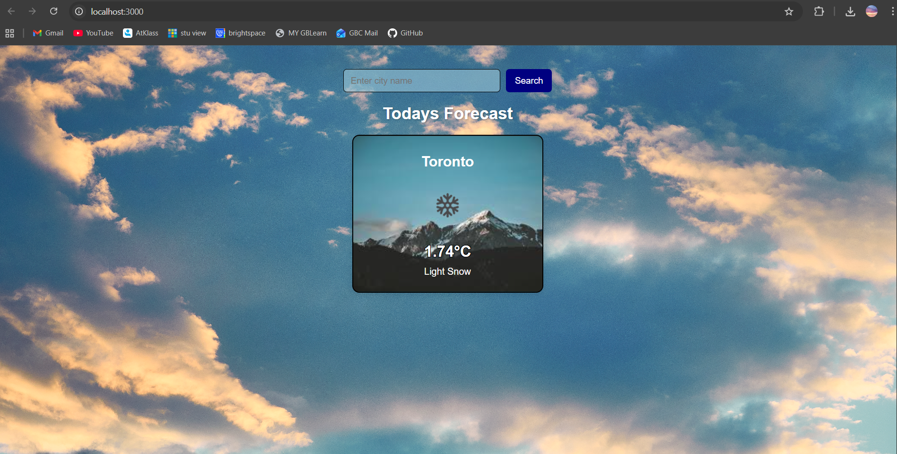
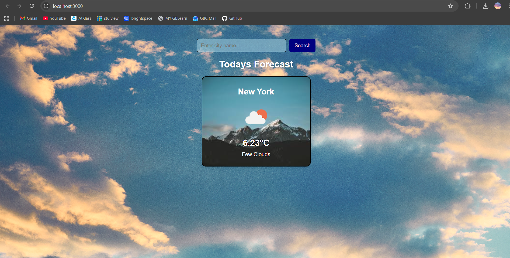

# Creation of Weather App in React (COMP 3123 Lab Test 2)

**Name:** Matthew Racco
**Student ID:** 101303971

## Documentation of steps taken:

**API used:** OpenWeatherMap Current Weather API

My first step was running the npx create for the layout of my react app. I then edited the
layout, removing unnecessary files. I made a new folder called components for my jsx files CitySearch and DisplayWeather, and I made an assets files for my pictures. I worked on my App.js file and newly added files to meet the assignment requirements.

After getting everything running, I started working on my css files. I messed around with the layout to make something pretty simple but unique for the styling.

## Screenshots
### Toronto

### New York
